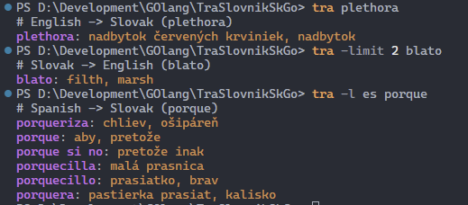

# tra-slovnik-sk-go

slovnik.sk from command line

## Description
Uses webpage slovnik.sk to translate between slovak and english.

## Usage
tra [-limit INT] INPUT WORD

### Example of use
open terminal
write and confirm your query `tra plethora` or `tra bahno`

### get result
```
> tra plethora
# English -> Slovak (plethora)
plethora: nadbytok červených krviniek, nadbytok

> tra bahno
# Slovak -> English (bahno)
bahno: dirt bed, clarts, scurf, sleech, slop, morass, bog, pulp, mud, scum
```

## Image
